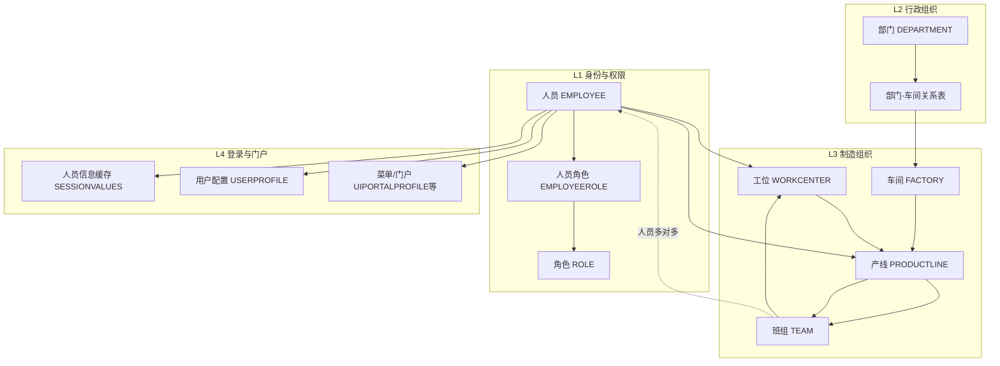
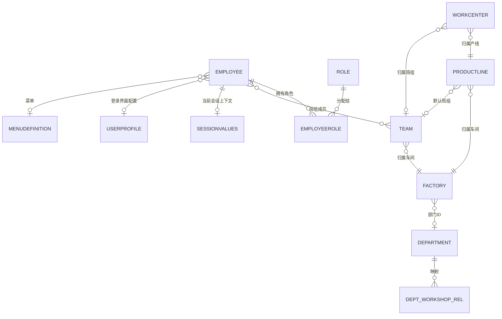
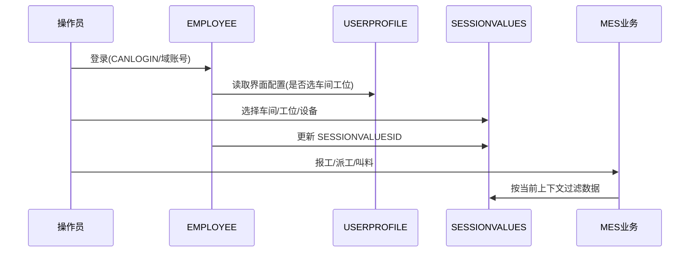

## Camstar  MES 人员模型

根据 `document/Camstar-MES 人员数据库表.md`，Camstar 老 MES 的人员管理并不是简单的「用户表 + 角色表」，而是把 **人事身份、制造现场组织、功能权限、登录上下文、门户个性化** 揉在同一套 CDO（Camstar Data Object）模型里。下面按模型结构说明。

---

## 一、总体设计特点

Camstar 人员管理有五个鲜明特征：

1. **GUID 主键体系**：核心业务 ID 多为 `CHAR(16)`（如 `EMPLOYEEID`、`TEAMID`、`FACTORYID`），属于 Camstar 对象引用风格，而非自增数字 ID。
2. **人员即系统用户**：没有独立的 `USER` 表，**人员（EMPLOYEE）同时承担登录账号**，通过 `CANLOGIN`、`DOCMANAGERUSER`（域账号）等控制认证。
3. **组织与权限分层**：行政组织（`DEPARTMENT`）与制造组织（车间→产线→班组→工位）并行，再通过映射表与部门关联。
4. **登录上下文（Session）独立建模**：车间、工位等现场信息不写在人员主表业务字段里长期保存，而是通过 `SESSIONVALUES` + 人员上的 `SESSIONVALUESID` 维护「当前作业上下文」。
5. **权限与 UI 强绑定**：菜单、门户首页、用户配置档、过滤器（`FILTERTAGS`）都挂在人员或角色上，属于「权限 + 界面 + 数据范围」一体化设计。

文档中的表可归纳为 **4 层**：



---

## 二、核心实体关系（ER 视角）



---

## 三、人员主数据模型（§1 人员表）

人员表是整套模型的中心，字段可分成 **6 类**：

| 分类               | 代表字段                                                     | 含义                                     |
| ------------------ | ------------------------------------------------------------ | ---------------------------------------- |
| **身份标识**       | `EMPLOYEEID`、`EMPLOYEEUSERNAME`、`FULLNAME`                 | 系统主键、人员编码（业务工号）、姓名     |
| **外部系统账号**   | `DOCMANAGERUSER`、`DOMAINNAME`、`ERPNO`、`CARDNO`            | 域账号、域名、ERP 号、员工卡号（刷卡）   |
| **在职/登录状态**  | `CANLOGIN`、`ISONDUTY`、`ISFROZEN`                           | 可否登录、是否在职、是否冻结             |
| **组织挂靠（弱）** | `PRIMARYORGANIZATIONID`、`JOBNAME`                           | 主组织、岗位名称（字符串，非规范岗位表） |
| **现场默认挂靠**   | `PRODUCTLINEID`、`WORKCENTERID`                              | 默认产线、默认工位（偏静态默认，非会话） |
| **资质相关**       | `WORKLICENSE`、`TRAININGPLANID`                              | 上岗证编号、培训组（资质入口之一）       |
| **权限/UI**        | `ESCROLEGROUPID`、`MENUDEFINITIONID`、`PORTALMENUDEFINITIONID`、`MODELERACCESS` | 角色组、菜单、门户菜单、建模器权限       |
| **会话/个性化**    | `SESSIONVALUESID`、`USERPROFILEID`、`UIPORTALPROFILEID`      | 当前 Session、登录界面配置、门户配置     |

要点：

- **业务主键对外是 `EMPLOYEEUSERNAME`（人员编码）**，`EMPLOYEEID` 是内部 GUID。
- **岗位 `JOBNAME` 是自由文本**，没有独立岗位主数据表，与芋道 `system_post` 的规范化程度不同。
- **上岗证 `WORKLICENSE` 只在人员表上有一个字段**，复杂资质（各车间多技能列）很可能在别的表或扩展逻辑里，文档未列出。
- 人员表上直接挂了 **多条菜单/门户 ID**，说明权限不仅是 RBAC，还有 **按人定制菜单/首页** 的能力。

---

## 四、制造组织模型（车间—产线—班组—工位）

这是 Camstar 与通用 OA/HR 系统差异最大的部分。

### 4.1 层级结构

```
企业 ENTERPRISE
  └── 部门 DEPARTMENT（行政）
        └── 部门-车间关系表（WORKSHOP_CODE ↔ DEPT_ID）
  └── 车间 FACTORY（制造分厂/车间，FACTORYNAME=车间编码）
        └── 产线 PRODUCTLINE（PRODUCTLINENAME=产线编码）
              └── 班组 TEAM（TEAMNAME=班组名称）
              └── 工位 WORKCENTER（WORKCENTERNAME=工位编码）
```

| 实体             | 主键            | 编码字段          | 上级                             | 业务含义                                       |
| ---------------- | --------------- | ----------------- | -------------------------------- | ---------------------------------------------- |
| 车间 FACTORY     | `FACTORYID`     | `FACTORYNAME`     | `DEPARTMENTID`、`ORGANIZATIONID` | 制造执行单元，挂派工规则、日历、培训组         |
| 产线 PRODUCTLINE | `PRODUCTLINEID` | `PRODUCTLINENAME` | `FACTORYID`                      | 流水线，含派工方式、班次时间、产线角色人员编码 |
| 班组 TEAM        | `TEAMID`        | `TEAMNAME`        | `FACTORYID`                      | 排班/派工单元，含班组长、调度员                |
| 工位 WORKCENTER  | `WORKCENTERID`  | `WORKCENTERNAME`  | `PRODUCTLINEID`、`TEAMID`        | 最小执行点，控制来料/流转/叫料/派工            |

### 4.2 人员与制造组织的关系（多种并存）

同一个人可能通过 **多条路径** 与现场关联，这是老 MES 常见但容易混乱的设计：

| 关联方式       | 机制                                          | 说明                                            |
| -------------- | --------------------------------------------- | ----------------------------------------------- |
| 人员→班组      | **班组人员关系表**（`EMPLOYEEID` + `TEAMID`） | 标准多对多，一人多班组                          |
| 人员→产线/工位 | 人员表 `PRODUCTLINEID`、`WORKCENTERID`        | 默认产线/工位，偏「主数据默认」                 |
| 人员→现场      | **SESSIONVALUES**                             | 登录后选择的当前车间/工位等，偏「运行时上下文」 |
| 产线→班组      | 产线表 `TEAMID`                               | 产线绑定默认班组                                |
| 工位→班组/产线 | 工位表 `TEAMID`、`PRODUCTLINEID`              | 工位归属                                        |

文档还提到 **部门-车间关系表** 的两个开关，说明查询逻辑也是模型的一部分：

- `IS_UNION_BY_DEPT`：是否按部门合并查询  
- `TEAM_LINE_HAS_RELATION`：班组与产线是否必须有关系  

即：**组织树 + 制造树 + 映射规则** 共同决定人员能看到的数据范围。

### 4.3 工位的「业务开关」模型

工位表不仅是主数据，还承担 **现场执行控制**（与人员资质/派工强相关）：

| 字段                                 | 作用                         |
| ------------------------------------ | ---------------------------- |
| `WORKCENTERSTATUS`                   | 是否允许派工                 |
| `INCOMING`                           | 是否允许来料                 |
| `TRANSFLAG`                          | 是否允许流转                 |
| `CALLINGFLAG`                        | 是否允许叫料                 |
| `BACKSTORELIMIT`                     | 回库限制（含班组长刷卡确认） |
| `DISPATCHRULEID`、`PROCESSABILITYID` | 派工规则、工位能力           |
| `TRAININGREQGROUPID`                 | 培训/资质要求组              |

人员能否在某工位作业，往往要同时满足：**角色权限 + 培训/资质组 + 工位状态开关**。

---

## 五、行政组织模型（§9 部门表）

`DEPARTMENT` 是行政维度组织，与车间通过 `DEPARTMENTID` 和 **部门-车间关系表** 双重关联：

| 字段                              | 说明                              |
| --------------------------------- | --------------------------------- |
| `DEPARTMENTID` / `DEPARTMENTNAME` | 部门 GUID / 名称                  |
| `PDMDEPARTMENDCODE`               | PDM 部门编码                      |
| `OA_NO`                           | OA 部门编号（对接 OA 的关键字段） |
| `ENTERPRISEID`                    | 企业                              |

Camstar 的「部门」与「车间（FACTORY）」**不是同一棵树**：部门偏 HR/行政，车间偏制造，靠映射表桥接。这与芋道只用 `system_dept` 一棵树的做法不同，迁移时需要 **双树 + 映射**。

---

## 六、权限模型（角色 + 人员角色 + 菜单/过滤器）

### 6.1 RBAC 骨架

```
人员 EMPLOYEE ──< EMPLOYEEROLE >── ROLE
                      │
              ORGANIZATIONID（组织范围）
              PROPAGATETOCHILDORGS（是否继承子组织）
```

| 表                    | 作用                                         |
| --------------------- | -------------------------------------------- |
| `ROLE`                | 角色定义（`ROLENAME` 编码、`ROLETYPE` 类型） |
| `EMPLOYEEROLE`        | 人员-角色多对多，可带 **组织范围**           |
| 人员.`ESCROLEGROUPID` | 角色组（Camstar 可把多角色打包）             |

特点：

- 角色授权可限定 **组织维度**（`ORGANIZATIONID`），不是纯功能 RBAC，而是 **RBAC + 组织数据范围**。
- 人员表还有 `FILTERTAGS`、`FILTERTAGACCESS`、`FILTERTAGSESSION`，用于 **数据过滤器/行级范围**，类似自定义 data scope，但实现方式偏 Camstar 平台机制，而不是显式 `data_scope` 枚举。

### 6.2 功能权限与 UI 权限混合

权限不只来自 `EMPLOYEEROLE`，人员自身还直接绑定：

| 字段                                                     | 类型           |
| -------------------------------------------------------- | -------------- |
| `MENUDEFINITIONID`                                       | 标准菜单       |
| `PORTALMENUDEFINITIONID`                                 | 门户菜单       |
| `PORTALMOBILEMENUDEFINITIONID`                           | 移动端菜单     |
| `WEBMENUDEFINITIONID` / `WEBDWILLDOWNERMENUDEFINITIONID` | Web 菜单       |
| `MODELERACCESS`                                          | 建模器操作权限 |

即：**角色授权 + 个人菜单覆盖** 并存，和芋道「权限只通过角色→菜单」的纯粹 RBAC 有差异。

### 6.3 门户与页面（§11、§12）

| 表                | 作用                                     |
| ----------------- | ---------------------------------------- |
| `UIPORTALPROFILE` | 门户侧页面/主题/主页配置                 |
| `UIVIRTUALPAGE`   | 虚拟页面（子菜单、模板页、代码后置文件） |

人员通过 `UIPORTALPROFILEID`、`PORTALHOMEPAGE` 决定 **登录后落到哪个门户页**，属于制造 MES 常见的「操作员首页 = 工位看板」模式。

---

## 七、登录与会话模型（§13 人员信息缓存表）

Camstar 把 **「登录后选车间/工位」** 单独建模为 `SESSIONVALUES`（文档称「人员信息缓存表」）：

| 字段                     | 含义                                        |
| ------------------------ | ------------------------------------------- |
| `SESSIONVALUESID`        | 会话主键（人员表 `SESSIONVALUESID` 指向它） |
| `EMPLOYEEID`             | 人员                                        |
| `FACTORYID`              | 当前车间                                    |
| `WORKCENTERID`           | 当前工位                                    |
| `OPERATIONID`            | 工作中心                                    |
| `RESOURCEID`             | 设备                                        |
| `APPLICATION` / `CLIENT` | 应用/客户端                                 |

流程可以理解为：



`ALLOWOVERRIDESESSIONVALUES` 表示是否允许浏览器 Session 覆盖平台 Session，说明还存在 **Web Session 与 Camstar Session 双层机制**。

这与芋道「登录后发 Token，数据权限靠 `dept_id` + `data_scope`」完全不同：**Camstar 更强调现场上下文（工位级）而不是部门级 data scope**。

---

## 八、班组模型补充（§2、§3）

### 8.1 班组人员关系表

- `EMPLOYEEID` + `TEAMID` + `SEQUENCE`：标准 **多对多 + 排序**（一人多班组、班组内顺序）。

### 8.2 班组定义表

除名称外，还冗余了管理角色信息（部分标注已弃用）：

| 字段                                       | 说明                                        |
| ------------------------------------------ | ------------------------------------------- |
| `TEAMLEADER_NAME` / `TEAMLEADER_CARD_NO`   | 班组长                                      |
| `DISPATCHER_NAME` / `DISPATCHER_ERP_CODE`  | 调度员                                      |
| `CHECKERID` / `DISPATCHERID` / `MONITORID` | 检验员/调度员/班长（GUID，标注弃用→多对多） |
| `PROCESSABILITY`                           | 班组能力                                    |
| `FACTORYID`                                | 所属车间                                    |

说明早期用 **单字段挂一个人**，后期改为 **关系表多对多**，表结构上有历史包袱。

---

## 九、Camstar 通用平台字段（几乎所有表都有）

文档里多张表重复出现：

| 字段                                                 | 含义                       |
| ---------------------------------------------------- | -------------------------- |
| `CDOTYPEID`                                          | 对象类型（Camstar 元数据） |
| `CHANGECOUNT` / `CHANGEHISTORYID` / `CHANGESTATUSID` | 变更审计                   |
| `ISFROZEN`                                           | 冻结（软停用）             |
| `FILTERTAGS`                                         | 数据过滤标签               |
| `ICONID`                                             | 图标                       |
| `NOTES` / `DESCRIPTION`                              | 备注                       |

含义：**人员相关对象都纳入 Camstar 变更管理与对象模型**，不是普通业务 CRUD 表。

---

## 十、模型总结（一句话 + 对比芋道）

**Camstar 老 MES 人员管理模型 =**

> **以 EMPLOYEE 为中心的身份账号**  
>
> + **DEPARTMENT / FACTORY 双轨组织**  
> + **产线—班组—工位制造树**  
> + **ROLE / EMPLOYEEROLE 的功能与组织范围授权**  
> + **SESSIONVALUES 现场登录上下文**  
> + **菜单/门户/过滤器/UI 配置一体化**

| 维度       | Camstar 老 MES                   | 芋道（JUMP）典型做法       |
| ---------- | -------------------------------- | -------------------------- |
| 用户主体   | EMPLOYEE 即用户                  | `system_users` 独立账号    |
| 主键       | CHAR(16) GUID                    | BIGINT 自增                |
| 组织       | 部门 + 车间双轨                  | `system_dept` 单树         |
| 制造组织   | 车间/产线/班组/工位完整建模      | `mes_md_workshop` 等需补全 |
| 岗位       | `JOBNAME` 文本                   | `system_post` 规范表       |
| 数据范围   | FILTERTAGS + 组织ID + Session    | `data_scope` + `dept_id`   |
| 登录上下文 | SESSIONVALUES 独立表             | 一般无，需新建             |
| 资质       | `WORKLICENSE` + `TRAININGPLANID` | 需独立资质模块             |
| 权限       | 角色 + 个人菜单 + 过滤器         | 角色 → 菜单 `permission`   |

---

## 十一、迁移/对接时的注意点

1. **对齐主键**：迁移必须保留 `EMPLOYEEID` 映射，不能只迁 `EMPLOYEEUSERNAME`。  
2. **区分三种「组织」**：行政部门、车间 FACTORY、登录 Session 车间，不能混为 `dept_id`。  
3. **班组用关系表**：人员-班组以 §2 关系表为准，不要只用人员表上的冗余字段。  
4. **权限拆分迁移**：角色（EMPLOYEEROLE）→ 芋道角色；菜单/门户 → 单独映射，不宜一次性硬转。  
5. **Session 要单独设计**：统一门户登录后，Ry-MES 仍需「选车间/工位」能力，应对应 `SESSIONVALUES` 语义。  
6. **资质不在本文档**：上岗证只有单字段，各车间复杂资质需结合 `MES 人员资质.md` 另表或扩展表分析。

如果你需要，我可以再出一版 **「Camstar 表名 ↔ 建议 Ry-MES/芋道表」逐字段对照表**，方便写同步接口。