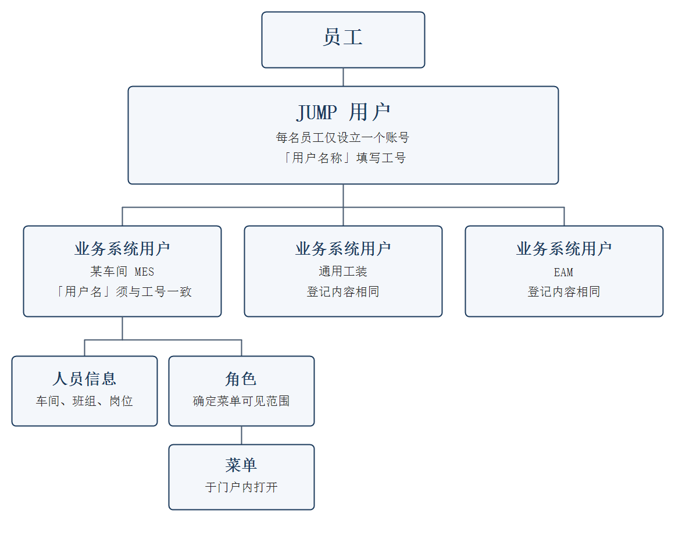

# JUMP 统一门户使用人员操作手册

| 文档属性 | 内容 |
|---|---|
| 适用读者 | 全体系统使用人员（工艺、生产及管理人员等）。第七节「车间管理员操作」面向负责为车间人员开通账号、维护角色的车间管理员 |
| 前置条件 | 已由管理员开通门户账号并分配角色。如尚未开通，请联系系统管理员 |

## 一、系统简介

JUMP 为公司统一登录门户。此前各车间 MES、通用工装系统、EAM 系统等均设有独立地址与账号，须分别登录。接入 JUMP 后，**登录门户一次，即可进入全部已授权的业务系统**，无需记忆各系统地址，亦无需再次登录。

对不同使用场景的改善如下：

- **现场操作人员**：登录后进入个人快捷导航，常用页面可直接打开，无需在列表式菜单中逐层查找；
- **跨车间管理人员**：同一部门下各车间 MES 相互独立，可通过门户在多套系统之间切换查阅，无需逐一登录；
- **全体使用人员**：仅需记忆一个门户地址及一套账号密码。

## 二、登录门户

1. 打开门户地址（http://192.168.240.129:8088）；
2. 输入用户名与密码。用户名支持工号、域账号等已登记标识，系统自动识别；密码为门户密码；
3. 需要时可勾选「记住我」，点击【登录】进入门户首页。

说明：

- 首次使用或忘记密码时，请联系系统管理员重置；
- 退出登录后，经门户打开的全部业务系统会话一并结束；
- 直接关闭浏览器后，本次登录即告失效，再次使用须重新登录。

## 三、门户首页与快捷导航

- **快捷导航**：首页展示常用页面入口，点击即可打开相应业务页面。常用入口可在「全部应用」中点击星标，加入快捷导航；
- **取消快捷导航**：
  1. 打开「全部应用」，对已加入快捷导航的页面再次点击星标（提示为「取消快捷导航」）；
  2. 或在首页按住该图标约一秒，于弹出菜单中点击【取消订阅】。
  图标带锁的入口为角色默认快捷入口，不可取消。如需将已调整的首页恢复为角色原有配置，请在下述调整顺序状态下点击【恢复角色默认】。
- **调整快捷导航顺序**：
  1. 在首页按住任一快捷图标约一秒，于弹出菜单中点击【调整顺序】；
  2. 按住图标拖至目标位置，松开后顺序即予保存；
  3. 点击【完成】退出调整。此状态下亦可点击图标右上角减号，取消本人收藏的入口；带锁的入口不可移除。
- **工作台与全局搜索**：用于快速定位功能与页面入口；
- **默认系统**：可在系统切换下拉列表中点击星标进行设定，登录后自动进入该系统。

## 四、切换业务系统

- 门户顶部显示「当前系统」，点击下拉列表即可切换至其他已授权系统；
- 切换后，左侧菜单与页面内容随之更换，**全程无需重新登录**；
- 同一会话内自动保留上次所在系统，刷新页面后仍停留于该系统。

## 五、打开与使用业务页面

- 点击左侧菜单或快捷导航卡片，即可打开业务页面。页面在门户窗口内呈现，底部任务栏显示已打开的页签；
- 多个页签可点击切换。已打开的页面在切换时不重新加载；页签关闭后再次打开，通常即可恢复；
- 页面打开较慢时，系统将提示「仍在等待」。可选择继续等待或重试；重试将自动修复登录凭证后重新加载；
- 业务页面内的操作（查询、保存、审批等）仍为原系统功能，数据与权限以该系统为准。

## 六、退出登录

点击右上角【退出登录】，门户与全部业务系统会话一并结束。使用共用计算机时，须先退出登录，再离开。

## 七、车间管理员操作

本节面向车间管理员，说明车间日常的人员开通与权限维护：**新建用户、为用户分配角色、为角色关联菜单**。一般使用人员可略过本节。

**操作入口**：以车间管理员账号登录门户。车间、角色、业务系统用户在左侧「业务系统」分组下维护；JUMP 登录账号在「系统管理 → 用户管理」中新建并关联。相关页面与按钮须由 JUMP 系统管理员预先授权。如无法看到相应菜单或按钮，请联系管理员开通。

**操作总览**：为新员工开通某套车间 MES 时，按下列顺序操作：

1. 新车间投产或部门调整时，先维护「车间对照」（7.1）；
2. 尚无适用角色时，先新建角色并关联菜单（7.2）；
3. 先建立 JUMP 用户（门户登录账号），再登记并关联该员工在目标业务系统中的用户（7.3），然后分配角色（7.4）。关联完成后，员工即可使用门户账号登录，并查看已授权菜单。

### 门户、人员、角色与菜单的关系

员工通过 JUMP 统一门户使用各业务系统。账号、人员、角色与菜单的对应关系如下。

**1. 门户账号**

每名员工在门户中仅有一个登录账号，称为 JUMP 用户，在「系统管理 → 用户管理」中维护。「用户名称」为登录名，一般填写工号。员工凭该账号登录后，可进入已为其开通的全部业务系统，无需分别记忆各系统地址，亦无需再次登录。

**2. 业务系统中的人员记录**

JUMP 用户仅用于门户登录。员工使用某一套具体系统（如某车间 MES、通用工装或 EAM）时，还须在该系统中建立一条业务系统用户。业务系统用户在「业务系统管理 → 业务用户管理」中维护：每套系统一条记录，一名员工可对应多套系统。该记录登记其在本系统中的车间、班组、岗位、角色，以及进入系统后默认打开的主页面。

**3. 门户账号与业务系统用户的关联**

业务系统用户的「用户名」须与 JUMP 用户的「用户名称」一致，一般均为工号。二者一致并完成关联后，员工使用该门户账号，即可进入相应业务系统。

业务系统用户状态为「未关联」时，表示该人员记录尚未对应门户账号。此时员工可以登录门户，但无法进入该业务系统。

**4. 角色与菜单**

角色按业务系统分别建立，在「统一门户系统 → 业务角色管理」中维护。应先为角色勾选可见菜单，再将该角色分配给本系统的业务系统用户。员工在该系统中可见的页面，即为其角色所勾选的菜单。在门户中点击菜单，即可打开相应业务系统的页面。

同一名员工在不同业务系统中可分配不同角色。角色或菜单调整后，已登录的员工须重新登录门户，调整方可生效。

**5. 关联与注册须分别完成**

将业务系统用户对应至 JUMP 用户，称为关联。关联用于确定员工能否从门户进入该业务系统。

在业务系统用户上执行「注册」，是将该人员推送至对方系统，并在对方系统中建立账号。对方系统尚未建立该人员时，业务页面可能无法正常使用。此项与门户账号是否已经关联无关，两项均须完成。

门户中的角色仅确定员工能否查看菜单。页面中的按钮能否操作，仍须在 Camstar 中按该系统的角色另行设置。两处均须维护，各自负责一部分。

### 7.1 维护车间对照（新车间投产或部门调整时）

「车间对照」用于维护 JUMP 部门与车间的对应关系，是新建用户时「车间」下拉选项的来源。

1. 进入「业务系统 → 车间对照」；
2. 点击【新增对照】，填写下表内容，点击【确定】保存。

| 字段 | 填写说明 |
|---|---|
| JUMP 部门 | 必选。新建用户时，按用户所属部门自动带出对应车间 |
| 车间编码 | 必填，须与业务系统一致，如 4200 |
| 车间名称 | 必填，如二部一车间 |
| 说明 | 选填 |

- 可按部门、车间编码、车间名称检索。行内可执行【修改】【删除】；勾选后可执行【批量删除】；
- 多个部门可对应同一车间。

### 7.2 新建角色并关联菜单

角色为一类岗位的权限集合。应先为角色勾选可见菜单，再将角色分配给用户。

**说明**：门户中的角色用于确定该角色能否查看相应页面菜单。页面中的按钮权限，仍须在 Camstar 系统中维护该用户的角色。两套系统均须设置，各自负责一部分：门户确定菜单是否可见，Camstar 确定页面中的按钮是否可用。

**新建角色**：

1. 进入「统一门户系统 → 业务角色管理」；
2. 在左侧列表中点击目标业务系统（如「制造二部 MES」），右侧即显示该系统的角色；
3. 点击【新增】，填写角色名称（如「工艺工程师」）、角色标识（如 process_engineer）、角色顺序、状态（保持「正常」），点击【确定】。

**为角色关联菜单**：

1. 在角色列表中找到目标角色，点击行操作【菜单权限】；
2. 在弹窗的菜单树中勾选该角色可见的目录与页面。**勾选页面时，系统自动带上该页面的按钮权限**，无需逐项勾选按钮；
3. 需要时可使用「展开/折叠」「全选/全不选」辅助勾选；
4. 点击【确定】保存。

说明：

- 保存后权限即时生效。已在线员工下次进入该系统时适用；若提示「权限已变更，请重新登录」，重新登录门户即可；
- 行操作【快捷导航】用于配置该角色的门户首页快捷入口，即该角色员工登录后可直接打开的常用页面；
- 菜单本身的增删（含页面地址）由门户管理员在「菜单管理」中维护，车间管理员仅需在此勾选。

### 7.3 新建用户并关联业务系统

一名员工在 JUMP 中具有两层账号，完成关联后方可从门户进入业务系统。

| 账号 | 维护位置 | 作用 |
|---|---|---|
| JUMP 用户 | 「系统管理 → 用户管理」 | 门户登录账号。每名员工一个。「用户名称」为登录名，一般填写工号 |
| 业务系统用户 | 「业务系统管理 → 业务用户管理」 | 该员工在某一套业务系统中的人员记录，登记车间、班组、角色及主页面。每套系统一条，一名员工可关联多套系统 |

关联规则：业务系统用户的**用户名**须与 JUMP 用户的**用户名称**一致，一般均为工号。关联完成后，员工使用该门户账号，即可进入已关联的业务系统。列表「状态」为「未关联」时，表示该人员记录尚未对应门户账号；此时员工可以登录门户，但无法进入该业务系统。

**方式一：新建 JUMP 用户时一并关联（推荐）**

1. 进入「系统管理 → 用户管理」，点击【新增】；
2. 填写用户姓名、归属部门、用户名称（工号）、用户密码、工号；域账号、刷卡卡号、ERP 账号等按需要填写；
3. 勾选「同时登记业务系统用户」，在「业务系统」中选择须开通的系统（可多选）；
4. 点击【确定】。所选系统下将建立同名业务系统用户，并直接关联至该 JUMP 用户。此步骤仅在门户登记，不调用对方系统接口；车间按该用户归属部门的车间对照自动带出；
5. 进入「业务系统管理 → 业务用户管理」，选中该系统并找到该用户，补充班组、岗位、角色、主页面（见 7.4）。需要在对方系统建立人员时，再按下述「接口注册」推送。

若该系统中已存在同名业务系统用户，勾选登记时将把已有记录关联至该 JUMP 用户，不再另行新建。该记录如已关联其他门户账号，则无法保存，须先解除原有关联。

**方式二：先建立业务系统用户，再关联至已有 JUMP 用户**

业务系统中已有人员记录，或 JUMP 用户已经建立时，采用本方式。

1. 进入「业务系统管理 → 业务用户管理」，于左侧选中目标业务系统，点击【新增】，按下表填写后点击【确定】。用户名须与 JUMP 用户的用户名称一致；
2. 进入「系统管理 → 用户管理」，找到该员工，点击【详情】；
3. 在「业务系统信息」中点击【添加业务系统】，选择目标系统；
4. 系统按用户名称匹配已有人员记录。提示已匹配后，可同时调整车间、班组、岗位、角色，点击【确定】完成关联；
5. 若提示不存在同名用户，应返回第 1 步，以与登录名相同的用户名新增或导入，再重新执行【添加业务系统】。

一名 JUMP 用户须进入多套系统时，重复执行【添加业务系统】即可。已经关联的系统不再出现于可选列表中。

业务系统用户表单：

| 字段 | 填写说明 |
|---|---|
| 业务系统 | 方式二中为只读，显示左侧所选系统 |
| 用户名 | 必填，须与 JUMP 用户的用户名称一致，一般填写工号 |
| 用户姓名 | 员工姓名 |
| 车间 | 从「车间对照」中选择。下拉列表为空时，表示尚未维护，请先按 7.1 办理 |
| 班组 | 选填。选择车间后可联动选择 |
| 岗位 | 选填，可多选 |
| 角色 | 可多选。可在此直接赋予角色，亦可保存后按 7.4 另行分配 |
| 主页面 | 选定角色后方可选择。选项为所选角色的可见菜单，即员工进入该系统后默认打开的页面 |
| 状态 | 正常或禁用。尚未关联 JUMP 用户时，列表显示为「未关联」 |
| 接口注册 | 保持默认「未注册」，并在「接口目标」中选择须开通账号的系统。保存时自动调用对方「新增人员」接口建立账号。对方系统已手工建立账号时，选择「已注册」，仅在门户登记 |
| 拼接车间 | 对方系统用户名全局唯一时勾选，以「车间编号_工号」注册（如 4200_10086），使同一工号可登录不同车间系统。是否勾选，按门户管理员的约定执行 |
| 备注 | 选填 |

说明：

- 「接口注册」是将人员推送至对方系统并建立账号，与「关联 JUMP 用户」不是同一事项。未关联时，无法从门户进入该系统；未注册时，对方系统中可能尚无该人员；
- 保存时如推送失败，列表中该用户仍显示「未注册」。可勾选后使用工具栏【批量注册】或行操作【注册】重试：选定接口目标后逐项推送，单项失败不影响其他人员，修正后可再次推送；
- 人员较多时，可使用工具栏【导入】下载模板，按 Excel 批量登记。导入时可以暂不关联 JUMP 用户，随后按方式二以相同用户名完成关联；
- 班组、岗位的选项分别来自「业务系统 → 班组管理」和「业务系统 → 岗位管理」。

### 7.4 为用户分配或调整角色

1. 进入「业务系统管理 → 业务用户管理」，选择业务系统；
2. 找到目标用户，点击行操作【分配角色】；
3. 勾选角色（可多选），点击【确定】。

亦可点击行操作【修改】，在弹窗中直接调整「角色」。

说明：

- 角色确定该员工在该业务系统中可见的菜单。调整后如未立即生效，请该员工重新登录门户；
- 需要临时停用账号时，在【修改】中将状态改为「禁用」即可，无需删除。

## 八、常见问题

| 现象 | 原因 | 处理 |
|---|---|---|
| 登录后无法看到某个业务系统 | 尚未开通该系统权限 | 联系系统管理员登记并分配角色 |
| 点击菜单后页面空白，或提示需要登录 | 登录凭证未传递，或账号在该系统尚未开通 | 先点击重试一次；仍然异常时，请联系管理员 |
| 提示「权限已变更，请重新登录」 | 管理员调整了角色或菜单权限 | 重新登录门户后即可生效 |
| 页面打开缓慢 | 相应业务系统响应缓慢 | 按提示等待或重试；持续缓慢时，请向管理员反馈 |
| 需要取消或调整首页快捷入口 | 本人加入的入口可以取消，亦可调整顺序；带锁的入口为角色默认配置，不可取消 | 按住首页图标约一秒，选择【取消订阅】或【调整顺序】（见第三节） |
| 忘记密码 | — | 联系系统管理员重置 |
| 新建用户时「车间」下拉列表为空 | 车间对照尚未维护 | 先在「业务系统 → 车间对照」中新增对照（见 7.1） |
| 业务系统用户状态持续为「未关联」 | 人员记录尚未对应 JUMP 登录账号 | 用户名须与 JUMP 用户名称一致，再在「系统管理 → 用户管理 → 详情 → 添加业务系统」中完成关联（见 7.3） |
| 能够登录门户，但无法看到某套业务系统 | 该系统的业务系统用户尚未关联，或尚未分配角色 | 按 7.3 完成关联，再按 7.4 分配角色 |
| 调整角色或菜单权限后，员工看不到变化 | 在线会话尚未刷新 | 请该员工重新登录门户 |

## 九、获取帮助

- 门户登录、系统权限、账号问题：联系 JUMP 系统管理员；
- 车间管理操作权限（无法进入「业务系统」下的页面，或按钮不显示）：联系 JUMP 系统管理员开通；
- 业务页面内的功能与数据问题：联系相应业务系统的维护人员。
