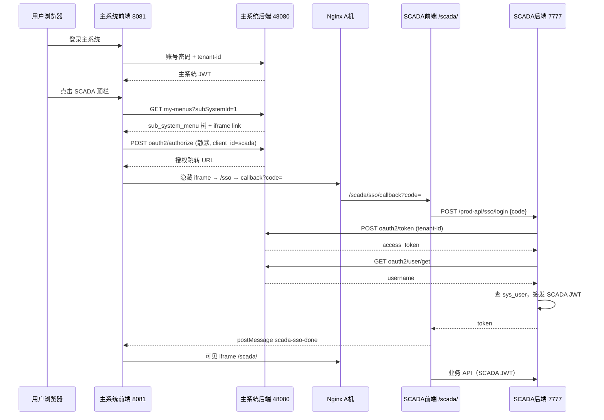
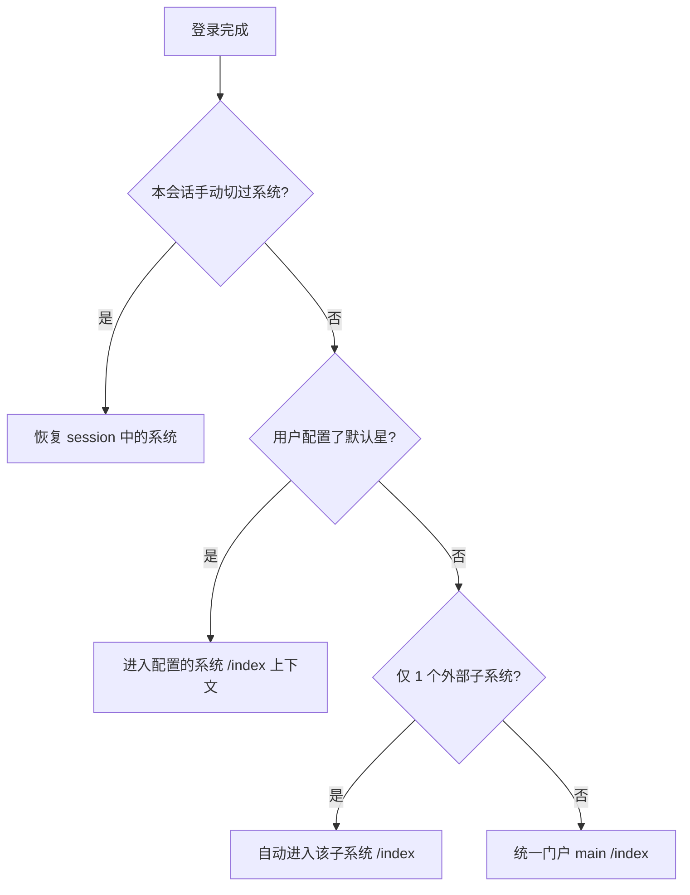
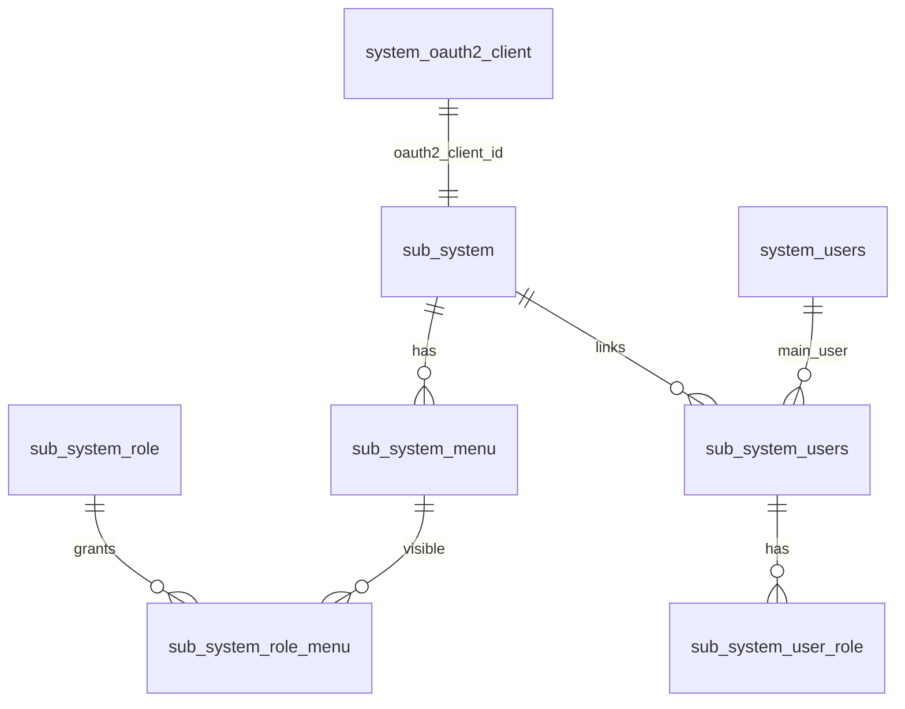

# 主系统访问子系统（Portal + SSO + iframe）集成指南

> 本文档基于当前 **JONHON-JUMP 主系统 + SCADA 子系统** 已跑通的方案整理。  
> 目标：新增子系统时，按清单配置即可，无需重复踩坑。

---

## 1. 总体架构

### 1.1 机器与职责（以 SCADA 为例）

| 角色 | 地址 | 职责 |
|------|------|------|
| **A 机 — 主系统门户** | `http://10.17.65.11:8081` | Nginx 统一入口；主系统 Vue；反代子系统前端 `/scada/`、子系统 API `/prod-api/` |
| **A 机 — 主系统后端** | `http://10.17.65.11:48080/admin-api` | OAuth2 授权中心、子系统菜单/用户、门户 API |
| **B 机 — 子系统前端** | `http://10.1.19.34:28080/scada/` | SCADA Vue 静态资源 |
| **B/C 机 — 子系统后端** | `http://10.1.19.39:7777` | SCADA Java API；调用主系统 OAuth 换 token |

### 1.2 用户看到的是什么

```
┌─ 主系统外壳（A 机 8081）────────────────────────────────────┐
│ 顶栏：工作台 | SCADA 数采系统                                  │
│ ┌─ 左侧菜单（主系统 DB）─┐ ┌─ iframe（子系统页面，无侧栏）─────┐ │
│ │ 来自 sub_system_menu  │ │ http://8081/scada/#/system/user │ │
│ └───────────────────────┘ └─────────────────────────────────┘ │
└───────────────────────────────────────────────────────────────┘
```

- **左侧菜单**：主系统 PostgreSQL 的 `sub_system_menu`（按用户角色过滤）
- **iframe 内容**：子系统真实页面（同域 `/scada/` 反代，避免跨域）
- **URL 形态**：`/portal/{client_id}/{菜单路径}`，例如 `/portal/scada/system/user`

### 1.3 三种「凭证」不要混淆

| 凭证 | 谁签发 | 存在哪 | 用途 |
|------|--------|--------|------|
| **主系统 Access Token** | 主系统 `/admin-api` 登录 | 浏览器 Cookie / localStorage | 访问主系统 API、顶栏切换、拉子系统菜单 |
| **OAuth2 Authorization Code** | 主系统 OAuth2 | 一次性，URL 参数 `?code=` | 子系统后端向主系统换 token |
| **子系统 JWT** | 子系统后端 `/sso/login` | 子系统 Cookie（path=`/scada/`） | iframe 内访问子系统 `/prod-api` |

主系统 token **不会**直接给子系统 API 用；子系统通过 OAuth code 自行换门户用户信息，再签发自己的 JWT。

---

## 2. 完整访问流程（时序）

### 2.1 用户登录主系统

1. 用户打开 `http://10.17.65.11:8081`，登录（含租户 `tenant-id`）。
2. 主系统返回 JWT，前端后续请求带 `Authorization` + `tenant-id`。
3. 主系统菜单来自 `system_users` 权限；子系统列表来自 `GET /system/sub-system-users/my-external-systems`。

### 2.2 用户点击顶栏「SCADA」

1. 前端 `portal/switchSystem('scada')` → `enterSubSystem({ clientId: 'scada' })`。
2. 调用 `GET /system/sub-system-users/my-menus?subSystemId=1` 拉菜单（**主库**）。
3. 动态生成路由 `/portal/scada/...`，左侧展示子系统菜单。
4. **静默 SSO**（`runSilentSso`）：
   - 主系统前端带登录态请求 `POST /admin-api/system/oauth2/authorize`（`client_id=scada`，`auto_approve=true`）。
   - 返回跳转 URL，放入 **隐藏 iframe** 加载。
5. 隐藏 iframe 打开主系统 `/sso?client_id=scada&redirect_uri=.../scada/sso/callback&...`。
6. 主系统 OAuth 自动授权，302 到  
   `http://10.17.65.11:8081/scada/sso/callback?code=xxx&state=scada`。
7. SCADA 前端 `ssoRedirect.js` 把 query 转到 hash：`/scada/#/sso/callback?code=xxx`。
8. `callback.vue` → `POST /prod-api/sso/login`（同域 Nginx 反代到 SCADA 后端）。
9. SCADA 后端 `PortalSsoService`：
   - `POST {api-url}/system/oauth2/token`（Basic `scada:secret`，**Header: tenant-id**）
   - `GET {api-url}/system/oauth2/user/get` → 得到门户 `username`
   - 用 `username` 查 SCADA 本地 `sys_user` → 签发 SCADA JWT → 写 Cookie
10. `callback.vue` `postMessage({ type: 'scada-sso-done', success: true })` 通知主系统。
11. 主系统隐藏 iframe 结束，加载 **可见 iframe**（菜单 link，如 `/scada/#/system/user`）。
12. SCADA `permission.js` 检测 `window.self !== window.top`，**隐藏** SCADA 自带侧栏/顶栏（embed 模式）。

### 2.3 流程图（Mermaid）



---

## 3. 主系统需要配置什么

### 3.1 数据库（PostgreSQL）

#### ① 注册子系统 `sub_system`

| 字段 | SCADA 示例 | 说明 |
|------|------------|------|
| `id` | `1` | 内部主键，API 用 `subSystemId` |
| `client_id` | `scada` | **URL 段** `/portal/scada/...`，且等于 OAuth2 client_id |
| `system_name` | SCADA 数采系统 | 顶栏/侧栏显示名 |
| `system_url` | `http://10.17.65.11:8081/scada` | iframe 基础地址（**同域反代**后的入口） |
| `status` | `0` | 启用 |

参考 SQL：`sql/postgresql/sub-system-import-scada-2026-06-15.sql`

#### ② OAuth2 客户端 `system_oauth2_client`

| 字段 | 要求 |
|------|------|
| `client_id` | OAuth2 客户端标识（来自 `system_oauth2_client.client_id`，如 `scada`）；`sub_system` 通过 `oauth2_client_id` 关联 OAuth2 客户端主键 |
| `secret` | 与子系统 `application.yml` 中 `client-secret` 一致 |
| `redirect_uris` | 子系统**前端**回调，如 `http://10.17.65.11:8081/scada/sso/callback` |
| `authorized_grant_types` | `authorization_code`, `refresh_token` |
| `scopes` / `auto_approve_scopes` | `user.read`（静默授权必需） |

参考 SQL：`sql/postgresql/sub-system-scada-nginx-proxy-2026-06-15.sql`

**改 OAuth 后必须**：重启主系统后端，或 `redis-cli DEL "oauth_client::scada"`。

#### ③ 子系统菜单 `sub_system_menu`

- 从子系统 `sys_menu` **导入**到主库（非实时同步）。
- 类型 `M` 目录 / `C` 菜单；`path` + `component` 用于拼 iframe URL：  
  `{system_url}/#/{父path}/{子path}`，如 `/scada/#/system/user`。
- 在主系统「外部系统 → 菜单管理」维护。

#### ④ 用户与权限

| 表 | 作用 |
|----|------|
| `sub_system_users` | 门户用户 ↔ 子系统（`main_user_id` + `sub_system_id`） |
| `sub_system_user_role` | 子系统内角色 |
| `sub_system_role_menu` | 角色可见菜单 |

门户用户要在 SCADA **也有同名** `sys_user`（SSO 按 `username` 匹配，不校验密码）。

#### ⑤ 主页面（可选）`sub_system_home_page`

- `home_page_url`：如 `http://10.17.65.11:8081/scada/#/index`

### 3.2 Nginx（A 机 8081）

每个子系统需要两段 location（名称以 SCADA 为例）：

```nginx
# 无尾斜杠重定向（必加，否则 /scada 会进主系统 Vue 404）
location = /scada {
    return 301 /scada/;
}

# 子系统前端 → B 机
location /scada/ {
    proxy_pass http://10.1.19.34:28080/scada/;
    # ... proxy_set_header 等
}

# 子系统后端 API（可与其它子系统共用前缀或各用各的）
location /prod-api/ {
    proxy_pass http://10.1.19.39:7777/;
}
```

完整示例：`sql/nginx/portal-a-machine-8081-user.conf.example`

### 3.3 主系统后端

- 多租户环境：OAuth token 接口要求 `tenant-id` 请求头（子系统后端调用时已支持）。
- 关键 API：
  - `GET /system/sub-system-users/my-external-systems` — 顶栏子系统列表
  - `GET /system/sub-system-users/my-menus?subSystemId=` — 门户侧栏菜单
  - `POST /system/oauth2/authorize` — 静默授权
  - `POST /system/oauth2/token` — 子系统后端换 token
  - `GET /system/oauth2/user/get` — 子系统后端取 username

### 3.4 主系统前端（一般新增子系统**不用改代码**）

已实现通用门户模块，新子系统只要 `client_id` 正确、菜单入库即可。

| 文件 | 作用 |
|------|------|
| `src/store/modules/portal.js` | 切换子系统、静默 SSO、菜单加载 |
| `src/store/modules/permission.js` | `GenerateSubSystemRoutes` 生成 `/portal/{clientId}/...` |
| `src/router/index.js` | 静态路由 `/portal/:clientId/...` → `PortalFrame.vue` |
| `src/views/system/subSystem/portal/PortalFrame.vue` | 注册 iframe 到 TagsView |
| `src/permission.js` | 进入 portal 前加载子系统；旧 URL `/portal/1/` 自动重定向 |
| `src/utils/portalRoute.js` | `client_id` 解析、菜单路径工具 |

---

## 4. 子系统需要配置什么

### 4.1 后端（以 SCADA/RuoYi 为例）

`scada-admin/src/main/resources/application.yml`：

```yaml
portal:
  sso:
    enabled: true
    portal-url: http://10.17.65.11:8081          # 主系统前端（跳转 /sso 授权页）
    api-url: http://10.17.65.11:48080/admin-api    # 主系统后端（换 token）
    client-id: scada                               # = system_oauth2_client.client_id（运行时 SSO/路由）
    client-secret: Scada@2026                      # = system_oauth2_client.secret
    redirect-uri: http://10.17.65.11:8081/scada/sso/callback  # 必须完全一致
    scope: user.read
    state: scada
    tenant-id: 1                                   # = 门户登录租户 ID
```

关键 Java（已实现，新子系统可复制模式）：

| 类 | 作用 |
|----|------|
| `PortalSsoProperties` | 读取上述配置 |
| `PortalSsoService` | 调主系统 token/user 接口（带 `tenant-id`） |
| `SysSsoController` | `GET /sso/config`、`POST /sso/login` |
| `SysLoginService.loginByPortal` | username 匹配本地用户并签发 JWT |

**网络**：子系统后端必须能访问 `10.17.65.11:48080`。

### 4.2 前端

| 配置/文件 | 要求 |
|-----------|------|
| `.env.production` | `PUBLIC_PATH=/scada/`，`VUE_APP_BASE_API=/prod-api` |
| `src/utils/ssoRedirect.js` | OAuth 回调保留 `/scada/` 前缀 |
| `src/utils/auth.js` | Cookie path 为 `/scada/` |
| `src/utils/embed.js` | iframe 内隐藏侧栏/顶栏 |
| `src/permission.js` | iframe 内等待 SSO token，禁止跳 `/sso` 死循环 |
| `src/views/sso/callback.vue` | SSO 完成后 `postMessage` 通知主系统 |

构建：`npm run build:prod`，部署到 B 机 Nginx 的 `html/dist/scada/`。

### 4.3 子系统本地用户

- SSO **不校验**子系统密码。
- 门户 OAuth 返回 `username` → 子系统查本地 `sys_user.user_name`。
- **必须**存在同名且启用用户，否则 SSO 失败。

---

## 5. 新增子系统 Checklist（复制 SCADA 流程）

假设新系统代号 **`mes`**，`client_id=mes`。

### Step 0：规划

- [ ] 定 `client_id`（字母开头，如 `mes`）
- [ ] 定 Nginx 前缀（如 `/mes/`）和 API 前缀（如 `/mes-api/` 或共用 `/prod-api/`）
- [ ] 定部署 IP：前端机、后端机

### Step 1：主库 PostgreSQL

- [ ] `INSERT INTO sub_system (... oauth2_client_id=<OAuth2客户端id>, system_url='http://门户IP:8081/mes')`
- [ ] `INSERT INTO system_oauth2_client`（`client_id='mes'`，`redirect_uris` = `http://门户IP:8081/mes/sso/callback`）
- [ ] 清 Redis OAuth 缓存或重启主系统后端
- [ ] 导入/配置 `sub_system_menu`（可从子系统菜单脚本导入）
- [ ] 配置 `sub_system_role`、`sub_system_users`、用户角色关联
- [ ] 门户 `system_users` 用户在子系统库有同名账号

### Step 2：A 机 Nginx

- [ ] `location = /mes { return 301 /mes/; }`
- [ ] `location /mes/ { proxy_pass 子系统前端; }`
- [ ] `location /mes-api/ { proxy_pass 子系统后端; }`（或复用现有规则）
- [ ] `nginx -s reload`

### Step 3：子系统后端

- [ ] 复制 SSO 模块（`PortalSsoProperties`、`PortalSsoService`、`SysSsoController`）
- [ ] `application.yml` 填 `portal.sso.*`（`client-id=mes`，`redirect-uri` 与 OAuth 一致）
- [ ] `tenant-id` 与门户一致
- [ ] Security 放行 `/sso/**`
- [ ] 重启后端

### Step 4：子系统前端

- [ ] `PUBLIC_PATH=/mes/`，`VUE_APP_BASE_API=/mes-api`（与 Nginx 一致）
- [ ] 实现 `/sso/callback` 路由 + `ssoRedirect.js` + `embed.js` + `postMessage`
- [ ] 构建部署到前端机

### Step 5：验证

```powershell
# ① 子系统前端直连
curl.exe -I http://子系统前端IP/mes/

# ② 门户反代
curl.exe -I http://10.17.65.11:8081/mes/

# ③ SSO token（假 code，测 tenant/client）
curl.exe -X POST "http://10.17.65.11:48080/admin-api/system/oauth2/token" ^
  -H "Authorization: Basic bWVz:你的secret的Base64" ^
  -H "tenant-id: 1" ^
  -H "Content-Type: application/x-www-form-urlencoded" ^
  -d "grant_type=authorization_code&code=test&redirect_uri=http://10.17.65.11:8081/mes/sso/callback"
```

浏览器：

- [ ] 登录门户 → 顶栏出现 MES
- [ ] URL 为 `/portal/mes/home/index`
- [ ] F12 → `POST .../mes-api/sso/login` 返回 token
- [ ] iframe 内业务页正常，无双菜单栏

---

## 6. 关键 URL 对照表（SCADA）

| 用途 | URL |
|------|-----|
| 门户入口 | `http://10.17.65.11:8081/portal/scada/home/index` |
| 门户菜单页 | `http://10.17.65.11:8081/portal/scada/system/user` |
| iframe 实际加载 | `http://10.17.65.11:8081/scada/#/system/user` |
| OAuth redirect_uri | `http://10.17.65.11:8081/scada/sso/callback` |
| 子系统 SSO API | `POST http://10.17.65.11:8081/prod-api/sso/login` |
| 主系统 OAuth token | `POST http://10.17.65.11:48080/admin-api/system/oauth2/token` |

---

## 7. 常见问题

| 现象 | 原因 | 处理 |
|------|------|------|
| `/portal/scada/...` 404 | 主系统前端未部署最新包 | 重新 build 主系统 Vue |
| `/scada/` 404 | Nginx 未配或 B 机无 dist | 查 A/B 机 Nginx 与静态文件 |
| `redirect_uri 不匹配` | OAuth DB 与 yml 不一致或 Redis 缓存旧值 | 执行 SQL + 清 Redis |
| `租户标识未传递` | 子系统换 token 未带 `tenant-id` | yml 配 `portal.sso.tenant-id` |
| SSO 成功但提示用户不存在 | 门户 username 在子系统无账号 | 子系统建同名用户 |
| 双菜单栏 | 子系统 embed 模式未生效 | 部署含 `embed.js` 的前端包 |
| 标签页都叫「外部系统」 | 未部署 portal 标题修复 | 部署最新主系统前端 |
| `GET not supported` on `/sso/login` | 用浏览器直接打开 API | 必须 POST，看 F12 Network |
| 旧链接 `/portal/1/` | 已支持自动重定向 | 可改用 `/portal/scada/` |

---

## 8. 代码地图（快速定位）

### 主系统 — 后端

```
jonhonjump-module-system/
  controller/admin/user/SubSystemUsersController.java   # my-menus, my-external-systems
  service/user/SubSystemUsersServiceImpl.java         # 菜单树、buildIframeLink、buildSsoUrl
  controller/admin/oauth2/OAuth2OpenController.java     # /system/oauth2/token
  controller/admin/oauth2/OAuth2UserController.java     # /system/oauth2/user/get
```

### 主系统 — 前端

```
jonhonjump-ui-admin-vue2/src/
  store/modules/portal.js          # 子系统切换、静默 SSO
  store/modules/permission.js      # 子系统路由生成
  router/index.js                  # /portal/:clientId/...
  permission.js                    # 路由守卫、legacy 重定向
  utils/portalRoute.js             # client_id 路径工具
  views/system/subSystem/portal/PortalFrame.vue
  layout/components/TopBar/        # 顶栏子系统切换
```

### 子系统 — SCADA 参考

```
scada/scada-framework/.../PortalSsoService.java
scada/scada-framework/.../PortalSsoProperties.java
scada/scada-framework/.../SysLoginService.java       # loginByPortal
scada/scada-admin/.../SysSsoController.java
scada/ui/src/utils/embed.js
scada/ui/src/utils/ssoRedirect.js
scada/ui/src/views/sso/callback.vue
scada/ui/src/permission.js
```

### SQL / Nginx 模板

```
sql/postgresql/sub-system-scada-nginx-proxy-2026-06-15.sql
sql/postgresql/sub-system-import-scada-2026-06-15.sql
sql/nginx/portal-a-machine-8081-user.conf.example
sql/nginx/scada-b-machine-28080.conf.example
```

---

## 9. 设计要点（给架构Review）

1. **菜单在主库、页面在子系统**：权限统一在门户管控；业务仍跑在子系统。
2. **同域反代**：`/scada/` 与主系统同域，Cookie、iframe、OAuth redirect 才简单。
3. **OAuth code 只给子系统后端换 token**：不在浏览器暴露主系统 token 给子系统。
4. **静默 SSO**：`auto_approve_scopes` + 隐藏 iframe + `postMessage` 避免闪屏和手工点授权。
5. **URL 用 client_id**：`/portal/scada/` 比 `/portal/1/` 可读且与 OAuth 一致。
6. **embed 模式**：子系统在 iframe 内自隐藏壳层，避免双菜单。

---

## 10. 版本记录

| 日期 | 说明 |
|------|------|
| 2026-06-15 | 首版：SCADA 同域反代 + 静默 SSO + client_id 路由 + embed 模式 |

---

**维护**：新增子系统时，优先复制 `sql/postgresql/sub-system-scada-nginx-proxy-2026-06-15.sql` 与 SCADA SSO 代码，全局替换 `scada` → 新 `client_id` 与 IP 即可。

---

## 11. 统一门户前端：页面分层与「当前系统」

### 11.1 两套外壳，一个首页

| 路由 | 外壳组件 | 说明 |
|------|----------|------|
| `/index`、`/` | `views/index.vue`（独立全屏门户） | 工作台首页：快捷应用网格、待办、全部应用 |
| 其它业务路由 | `layout/components/PortalShell.vue` | 顶栏 + 底部 Dock + 中间 `AppMain`（含 iframe） |

`layout/index.vue` 根据 `isPortalHome` 决定用哪套外壳：

```js
// path === '/index' → 直接渲染 AppMain（即 index.vue）
// 其它路径 → PortalShell 包裹 AppMain
```

**重要设计**：所有子系统的「门户首页」都复用 **`/index`**，不再为每个子系统单独做 `/portal/{clientId}/home`。切换系统后只是换菜单、快捷导航和顶栏文案，URL 仍停留在 `/index`。

### 11.2 `currentSystem` 状态机

Vuex `portal.currentSystem` 只有两个语义：

| 值 | 含义 | 侧边栏菜单来源 |
|----|------|----------------|
| `'main'` | 统一门户（主系统） | `permission.sidebarRouters`（`system_menu` 权限树） |
| `clientId` 字符串 | 某个外部子系统，如 `scada` | 动态加载的 `sub_system_menu` 树 |

切换系统时 `portal/switchSystem` 会：

1. 缓存主系统侧栏（首次切走时保存到 `mainSidebarRouters`）
2. 若目标是子系统：`enterSubSystem` → 拉菜单 → `GenerateSubSystemRoutes` → 静默 SSO
3. 若 `stayOnPortalHome: true`：只换上下文，路由仍指向 `/index`
4. 会话内记住选择：`sessionStorage` 键 `portal_last_system`

### 11.3 路由模型（三张「地图」）

```
主系统业务路由          /system/user、/bpm/task/todo ...
统一门户首页            /index
子系统门户路由          /portal/{clientId}/{menuPath}
子系统 iframe 实际地址   {system_url}/#/{path}   （存在菜单 meta.link）
```

`utils/portalRoute.js` 负责：

- `parsePortalClientId(path)` — 从 URL 解析 `client_id`
- `isMainBusinessPath(path)` — 子系统模式下禁止直接跳主系统业务页
- `isSubSystemAllowedPath(path, clientId)` — 子系统模式下允许 `/index`、当前 `/portal/{clientId}/...`、`/user/...`
- `resolvePortalFrameRoute` — 静态 `PortalFrame` 路由 + `pathLinkMap` 还原 iframe 标题与链接

子系统菜单叶子节点在 `permission.js` 里生成路由时，会把 **iframe URL** 写入 `meta.link`；页面组件统一走 `PortalFrame.vue`（空壳，由 TagsView + iframe 真正展示内容）。

### 11.4 底部 Dock（任务栏）

`PortalDock.vue`：

- **首页**：回 `/index`（`portal/navigateToPortalHome`）
- **已打开应用**：来自 `tagsView.visitedViews`，过滤掉门户首页、纯占位路由
- **全部应用**：打开 `AllAppsDrawer` 抽屉

子系统 iframe 页与主系统 Vue 页共用同一套 Dock 页签；关闭页签时若已无业务页，则 `returnToPortalHome`。

---

## 12. 个人化能力：快捷导航 & 默认打开系统

这两套配置都是 **按用户 + 按系统维度** 独立存储，互不影响。

### 12.1 快捷导航

| 维度 | 数据表 | API 前缀 |
|------|--------|----------|
| 主系统 | `system_user_quick_nav` | `GET/PUT /system/user/quick-nav/*` |
| 外部子系统 | `sub_system_user_quick_nav` | `GET/PUT /system/sub-system-user/quick-nav/*`（带 `subSystemId`） |

**展示位置**：

- 门户首页 `/index` 的应用网格（`buildHomeApps`）
- 「全部应用」抽屉里每行左侧星星（`AllAppsDrawer` + `portalQuickNavToggle.js`）

**交互**：

- 点星 = 把该菜单 `menuId` 加入**当前系统**的快捷导航
- 再点 = 移除
- 「配置快捷导航」弹窗只编辑**当前系统**（`PortalQuickNavSettings.vue`）

主系统快捷应用统一蓝色；子系统统一青绿色。全部应用抽屉内按菜单 key 哈希分配多彩色（前端写死调色板）。

### 12.2 默认打开系统（登录后落点）

| 项目 | 说明 |
|------|------|
| 数据表 | `system_user_portal_default`（PostgreSQL 脚本：`sql/postgresql/system_user_portal_default.sql`） |
| 字段 | `sub_system_id`：NULL 为统一门户，否则关联 `sub_system.id`；API 仍返回 `defaultSystem`（`main` 或运行时 `clientId`） |
| API | `GET /system/user/portal-default/get`、`PUT .../save`（body: `{ subSystemId }`）、`DELETE .../clear` |

**配置入口**：顶栏「切换」下拉里，每行左侧星星（仅当用户有 **≥2 个** 外部子系统时显示）。

**登录后 `bootstrapAfterAuth` 优先级**：



- 星星最多 **1 个**；取消星星 = `configured=false`，走自动规则
- 只有 1 个子系统时不显示星星，直接自动进入，无需配置

---

## 13. 权限与菜单：主系统 vs 子系统

### 13.1 主系统

- 菜单：`system_menu` + `system_role_menu` + `system_user_role`
- 登录后 `GenerateRoutes(userInfo.menus)` 生成侧栏
- 业务页面是主系统 Vue 组件（非 iframe）

### 13.2 外部子系统

- **注册**：`sub_system`（`oauth2_client_id` → `system_oauth2_client.id`、`system_url` 等）
- **菜单在主库**：`sub_system_menu`（从子系统导入，非实时同步）
- **用户关联**：`sub_system_users`（`main_user_id` ↔ `sub_system_id`）
- **子系统内角色**：`sub_system_role`、`sub_system_user_role`、`sub_system_role_menu`
- **门户拉菜单**：`GET /system/sub-system-users/my-menus?subSystemId=`
- **顶栏列表**：`GET /system/sub-system-users/my-list`

门户只负责「展示哪些入口」；iframe 内真实业务仍跑在子系统前后端。子系统用户必须与门户 `username` 对齐（SSO 按用户名匹配）。

### 13.3 管理后台配置路径（运营视角）

1. **外部系统管理** → 注册 `sub_system`
2. **菜单管理** → 维护 `sub_system_menu`（目录/菜单、`link` 指向 iframe 地址）
3. **用户/角色/岗位** → 关联门户用户与子系统角色
4. **OAuth2 客户端** → 在「外部系统管理」中通过 `oauth2_client_id` 关联；运行时 `client_id` 字符串用于 SSO 与 `/portal/{clientId}` 路由

---

## 14. 端到端：从登录到打开子系统页面

```text
1. POST /admin-api/system/auth/login
   → 主系统 JWT + menus（主系统侧栏）

2. permission.js → GenerateRoutes
   → portal/bootstrapAfterAuth（默认系统 / 单系统等）

3. 用户停留在 /index
   → currentSystem = main 或某 clientId
   → 首页网格 = 对应系统的快捷导航

4. 用户点「全部应用」某菜单 / 首页快捷图标
   → 主系统路由：router.push('/system/user')
   → 子系统路由：router.push('/portal/scada/system/user')

5. 若 URL 以 /portal/{clientId} 开头
   → permission ensurePortalAccess
   → enterSubSystem（若未加载）
   → runSilentSso（隐藏 iframe OAuth）
   → TagsView 注册 iframe 视图
   → 可见 iframe 加载 meta.link（如 /scada/#/system/user）
```

---

## 15. 新子系统接入：最小数据依赖图



**缺一不可**：

- `sub_system.oauth2_client_id` 关联有效的 `system_oauth2_client` 记录
- 至少一条 `sub_system_menu` 且叶子带有效 `link`
- 当前门户用户在 `sub_system_users` 有记录且角色有菜单
- 子系统库存在同名用户 + SSO 模块 + Nginx 同域反代

---

## 16. 版本记录（续）

| 日期 | 说明 |
|------|------|
| 2026-06-17 | 补充：统一 `/index` 门户首页、`currentSystem` 状态机、快捷导航/默认系统个人化、登录 bootstrap 优先级、前端分层说明 |

